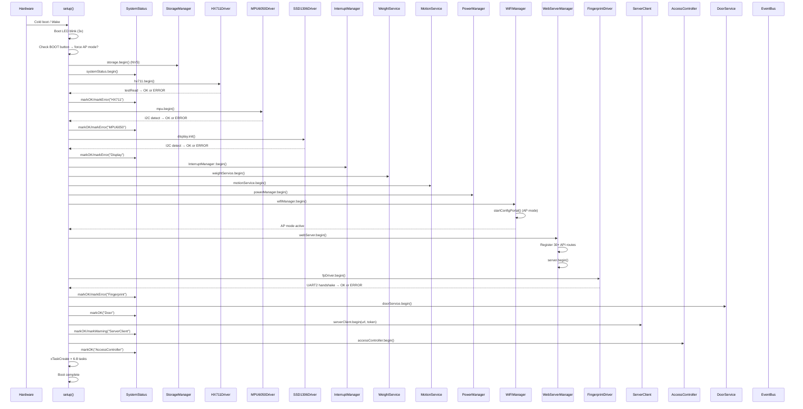
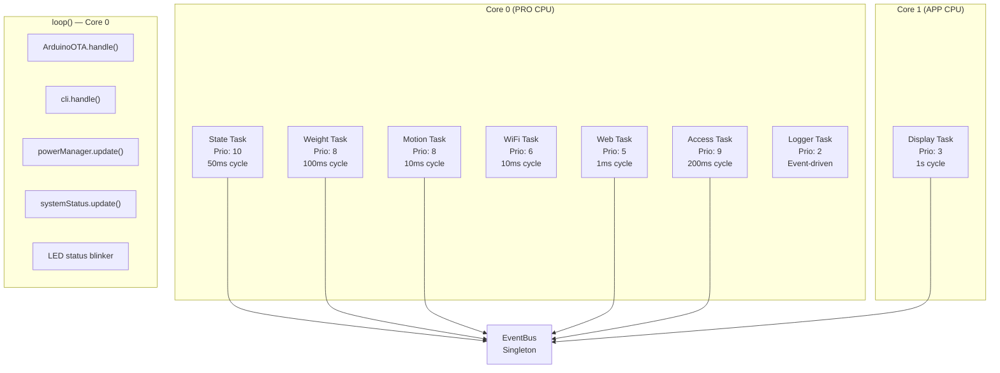
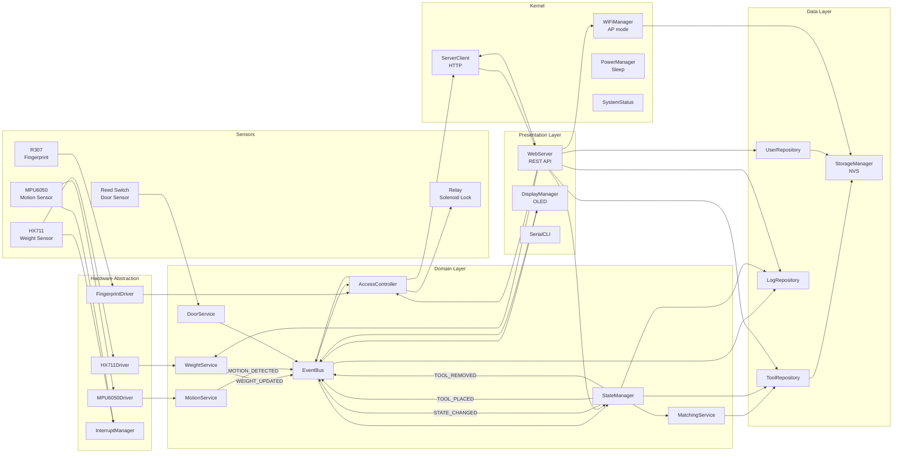
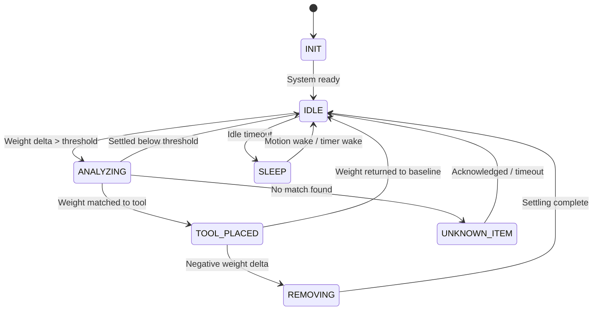
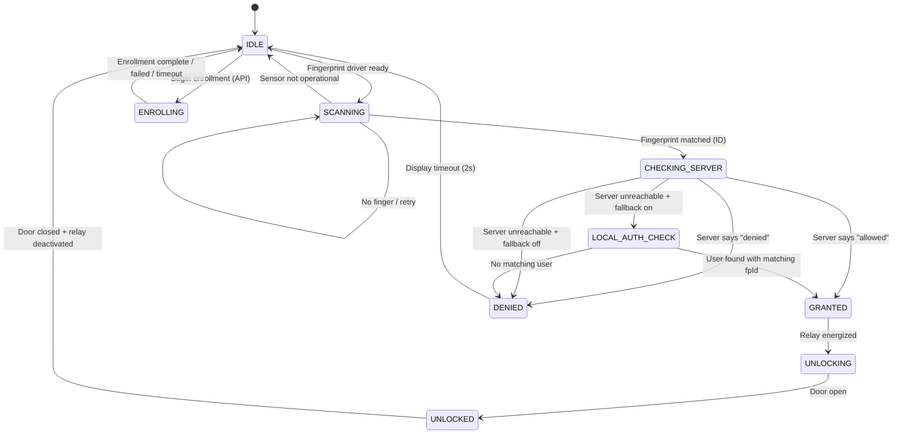
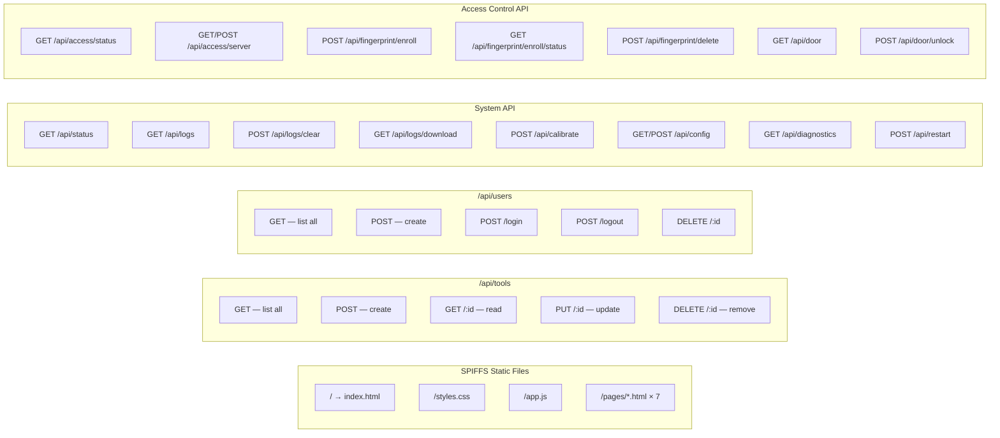
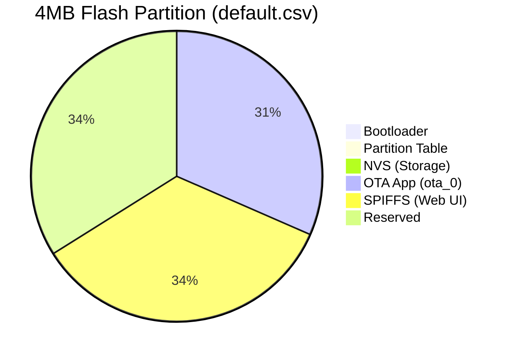
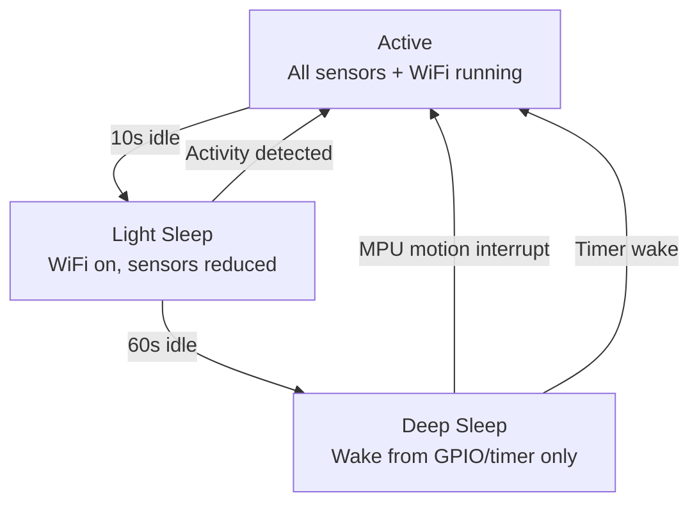

# ESP32 Inventory Box — Architecture

## Boot Sequence

## Task Architecture

## Event Flow

## State Machine

## Access Control State Machine

## API Routes

## Flash Layout

## Power States

