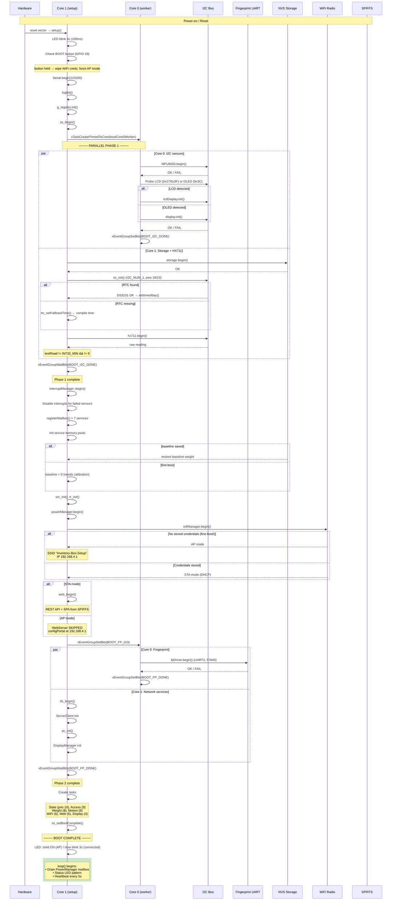

# First Boot Sequence (after flash)

```mermaid
sequenceDiagram
    participant HW as Hardware
    participant Core1 as Core 1 (setup)
    participant Core0 as Core 0 (worker)
    participant Sensors as I2C Bus
    participant FP as Fingerprint UART
    participant NVS as NVS Storage
    participant WiFi as WiFi Radio
    participant FS as SPIFFS

    Note over HW,FS: Power-on / Reset
    HW->>Core1: reset vector → setup()
    Core1->>Core1: LED blink 3x (100ms)
    Core1->>Core1: Check BOOT button (GPIO 33)
    Note over Core1: button held → wipe WiFi creds, force AP mode

    Core1->>Core1: Serial.begin(115200)
    Core1->>Core1: logInit()

    Core1->>Core1: g_registry.init()
    Core1->>Core1: ss_begin()

    Core1->>Core0: xTaskCreatePinnedToCore(bootCore0Worker)
    Note over Core1,Core0: ──── PARALLEL PHASE 1 ────

    par Core 0: I2C sensors
        Core0->>Sensors: MPU6050.begin()
        Sensors-->>Core0: OK / FAIL
        Core0->>Sensors: Probe LCD (0x27/0x3F) or OLED (0x3C)
        alt LCD detected
            Core0->>Sensors: lcdDisplay.init()
        else OLED detected
            Core0->>Sensors: display.init()
        end
        Sensors-->>Core0: OK / FAIL
        Core0->>Core0: xEventGroupSetBits(BOOT_I2C_DONE)
    and Core 1: Storage + HX711
        Core1->>NVS: storage.begin()
        NVS-->>Core1: OK
        Core1->>Sensors: rtc_init() (I2C_NUM_1, pins 18/23)
        alt RTC found
            Sensors-->>Core1: DS3231 OK → settimeofday()
        else RTC missing
            Core1->>Core1: rtc_setFallbackTime() ← compile time
        end
        Core1->>Sensors: hx711.begin()
        Sensors-->>Core1: raw reading
        Note over Core1: testRead != INT32_MIN && != 0
    end

    Core1->>Core1: xEventGroupWaitBits(BOOT_I2C_DONE)
    Note over Core1: Phase 1 complete

    Core1->>Core1: InterruptManager::begin()
    Core1->>Core1: Disable interrupts for failed sensors

    Core1->>Core1: registerMailbox() × 7 services

    Core1->>Core1: Init service memory pools
    alt baseline saved
        NVS-->>Core1: restore baseline weight
    else first boot
        Core1->>Core1: baseline = 0 (needs calibration)
    end

    Core1->>Core1: sm_init(), tr_init()
    Core1->>Core1: powerManager.begin()

    Core1->>WiFi: wifiManager.begin()
    alt No stored credentials (first boot!)
        WiFi-->>Core1: AP mode
        Note over Core1: SSID "Inventory-Box-Setup"<br/>IP 192.168.4.1
    else Credentials stored
        WiFi-->>Core1: STA mode (DHCP)
    end

    alt STA mode
        Core1->>Core1: web_begin()
        Note over Core1: REST API + SPA from SPIFFS
    else AP mode
        Note over Core1: WebServer SKIPPED<br/>configPortal at 192.168.4.1
    end

    Core1->>Core0: xEventGroupSetBits(BOOT_FP_GO)

    par Core 0: Fingerprint
        Core0->>FP: fpDriver.begin() (UART2, 57600)
        FP-->>Core0: OK / FAIL
        Core0->>Core0: xEventGroupSetBits(BOOT_FP_DONE)
    and Core 1: Network services
        Core1->>Core1: ds_begin()
        Core1->>Core1: ServerClient init
        Core1->>Core1: ac_init()
        Core1->>Core1: DisplayManager init
    end

    Core1->>Core1: xEventGroupWaitBits(BOOT_FP_DONE)
    Note over Core1: Phase 2 complete

    Core1->>Core1: Create tasks
    Note over Core1: State (prio 10), Access (9)<br/>Weight (8), Motion (8)<br/>WiFi (6), Web (5), Display (3)

    Core1->>Core1: ss_setBootComplete()

    Note over Core1: ──── BOOT COMPLETE ────
    Core1->>Core1: LED: solid ON (AP) / slow blink 3s (connected)

    rect rgb(200, 230, 200)
        Note over Core1: loop() begins:<br/>• Drain PowerManager mailbox<br/>• Status LED pattern<br/>• Heartbeat every 5s
    end
```
